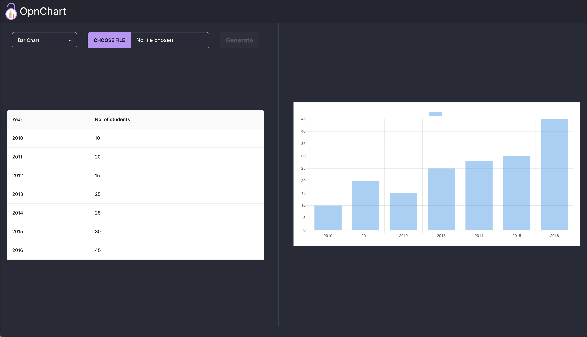

# OpnChart

This project is simple [next.js](https://nextjs.org/) project which uses [chart.js](https://www.chartjs.org/docs/latest/) to build different types of charts.

## Run locally

```bash
npm run dev
# or
yarn dev
# or
pnpm dev
# or
bun dev
```

Open [http://localhost:3000](http://localhost:3000) with your browser to see the result.

## Screenshots


