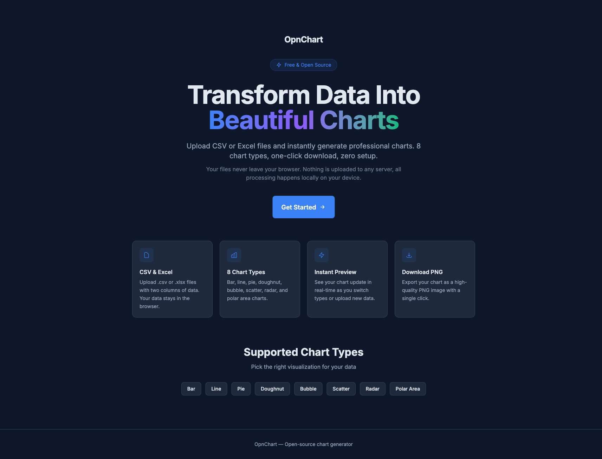
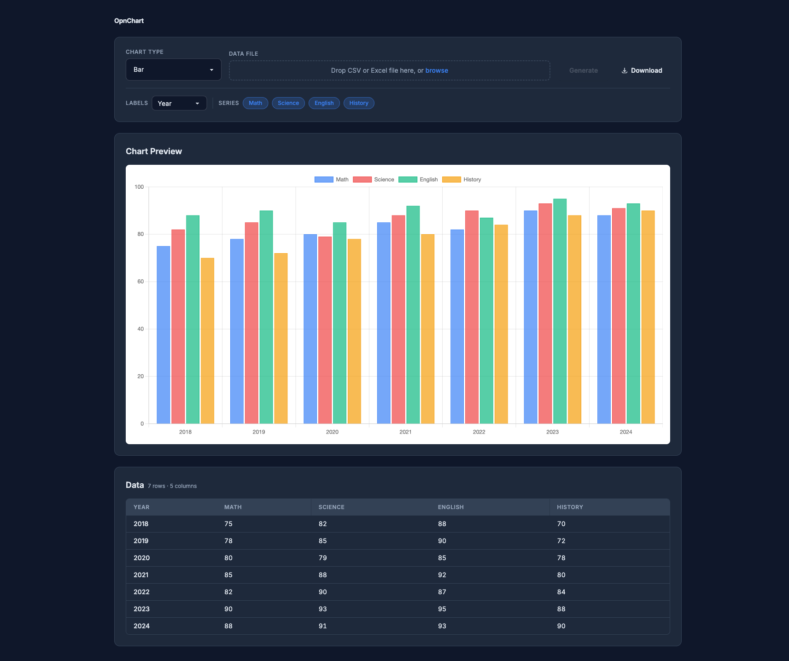

# OpnChart

Open-source chart generator. Upload CSV or Excel files and instantly create professional charts — bar, line, pie, doughnut, bubble, scatter, radar, and polar area. Your data never leaves your browser.

**Live:** [opnchart.abhinavankur.com](https://opnchart.abhinavankur.com)




## Features

- **CSV & XLSX support** — upload any `.csv` or `.xlsx` file
- **8 chart types** — bar, line, pie, doughnut, bubble, scatter, radar, polar area
- **Multi-column data** — auto-detects columns, lets you pick label and series
- **Multi-series charts** — plot multiple data columns on one chart
- **Paginated data table** — handles thousands of rows
- **Drag-and-drop upload** — drop files directly onto the page
- **Download as PNG** — one-click export with optional watermark
- **Runs in-browser** — your data never leaves the client

## Quick Start

```bash
git clone https://github.com/abhinavankur3/opnchart.git
cd opnchart
npm install
npm run dev
```

Open [http://localhost:3000](http://localhost:3000).

## Self-Hosting with Docker

### Using Docker Compose (recommended)

```bash
git clone https://github.com/abhinavankur3/opnchart.git
cd opnchart
docker compose up -d
```

The app will be available at `http://localhost:3000`.

To rebuild after pulling changes:

```bash
docker compose up -d --build
```

### Using Docker directly

```bash
docker build -t opnchart .
docker run -d -p 3000:3000 --name opnchart opnchart
```

### Configuration

Environment variables are set at **build time** (they are baked into the Next.js bundle).

| Variable | Default | Description |
|---|---|---|
| `NEXT_PUBLIC_WATERMARK` | `true` | Add "Generated using OpnChart" to downloaded PNGs |

To change a variable, pass it as a build arg:

```bash
# Docker Compose
docker compose build --build-arg NEXT_PUBLIC_WATERMARK=false
docker compose up -d

# Docker
docker build --build-arg NEXT_PUBLIC_WATERMARK=false -t opnchart .
```

For local development, edit `.env`:

```
NEXT_PUBLIC_WATERMARK=true
```

## Tech Stack

- [Next.js](https://nextjs.org/) 14
- [Chart.js](https://www.chartjs.org/)
- [Tailwind CSS](https://tailwindcss.com/) + [DaisyUI](https://daisyui.com/)
- [PapaParse](https://www.papaparse.com/) (CSV)
- [SheetJS](https://sheetjs.com/) (XLSX)

## License

MIT
